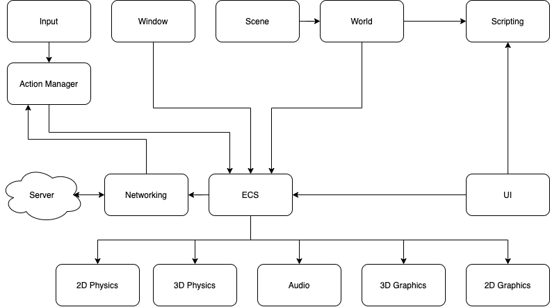

# Client

- [Client](#client)
  - [Graphics](#graphics)
  - [Window](#window)
  - [Audio](#audio)
  - [Input](#input)
  - [Networking](#networking)
  - [Scene](#scene)
  - [World](#world)
  - [Physics](#physics)
    - [2D Physics](#2d-physics)
    - [3D Physics](#3d-physics)
  - [UI](#ui)
  - [ECS](#ecs)
  - [Scripting](#scripting)
  - [Data](#data)
  - [Component Architecture](#component-architecture)

The player uses the client to connect to the server and play the game.

The client has these components - graphics, window, audio, input, networking, scene, world, physics, UI (User Interface), ECS (Entity Component System) and scripting.

Where possible, each component should work in its own thread and work independently of other components.

## Graphics

See [here](graphics.md) for more information.

## Window

Ability to create game window required. Full screen and windowed mode in multiple resolutions should be supported.

## Audio

Both stereo and 3D audio must be supported. MIDI and multi-channel sound tracks must be able to be played.

Audio should be handled in its own thread.

## Input

Keyboard, mouse, touch screen and game pad support is required. The input source should be abstracted into actions, which is what the game system will act on.

Input can be handled in the same thread as the windowing system.

## Networking

TCP and UDP must be supported. Network packets that must be received by the server should be sent via TCP. Packets that are not required should be sent over UDP.

UDP packets will be sent with a timestamp. This will help the server discard packets that are no longer up-to-date.

## Scene

Manages the current scene the player is in. A scene may or may not contain a world. The required scenes are:

- Loading
  - Handles the loading of worlds, various components and displays the loading UIs
- World
  - Contains the current running world and the UIs

## World

Receives all data from the server, so acts as reflection of the world on the server.

Avatars in the world take their input by means of actions. These actions come from either the server, or in the case of the player's avatar, from the player through the input system. The player's avatar data will be sent to the server.

The world is represented as a 2D grid of tiles. This grid of tiles is kept up to date on the client by the server sending any updates over the required network stream. Static models are represented by IDs and a tile index, where they are rendered by the client.

Avatar locations are sent from the server as 2D locations. 3D height coordinates are handled by the client side 3D physics system.

As the client will always receive historic NPC (non-player character) avatar locations, they will have their positions interpolated to predict their next position. This is done by having their current action as well as their most up-to-date location sent from the server. The client world will then use that action to predict the next location. When a new, accurate, location is received, the client will use that location with the new action for the prediction. This will result in NPCs having a near-accurate location and action representation on the client compared with the server. As all game logic is performed on the server, where accurate NPC locations are kept, the client not having 100% accurate NPC location details will not affect game play.

## Physics

2D and 3D physics are required.

### 2D Physics

Bounding box and circle collision, translation, rotation, dilation, reflection are required, along with acceleration and gravity. This will be used by the UI system and 2D particles.

### 3D Physics

Sphere, AABB (axis aligned bounding box), translation rotation, dilation, reflection, ray casting, acceleration and gravity are required.

Avatar locations are stored in 2D, even in the 3D world. The 2D X-coordinate represents the 3D X-coordinate. The 2D Y-coordinate represents the 3D Z-coordinate. The 3D Y-coordinate will be computed by the 3D physics system based on the height of the floor.

## UI

See [UI](ui.md) for more information.

## ECS

All entities in the game are managed by the ECS (entity component system). The client ECS acts on the data it sees. Entities that require their data updated from the server are updated by an ECS process.

The following components are required:

- `location_2d`
  - Contains the 2D location of this entity in screen space
- `location_3d`
  - contains the 3D location of this entity in the world
- `sprite`
  - Contains the data needed to render a 2D sprite. Requires a `location_2d` component.
- `mesh`
  - Contains the data needed to render a 3D mesh. If a `location_3d` component is attached, this mesh is rendered in world space. If a `location_2d` location is attached, the mesh is rendered in screen space.
- `material`
  - Contains the needed material data to render this entity, such as shader and textures.
- `rigid_body_2d`
  - Contains the needed data to handle 2D collisions, such as bounding box and circle collisions.
- `rigid_body_3d`
  - Contains the needed data to handle 3D collisions, such as sphere and AABB collisions.
- `velocity_2d`
  - Contains the needed data to impart movement to the attached `location_2d` component.
- `velocity_3d`
  - Contains the needed data to impart movement to the attached `location_3d` component.

## Scripting

Game logic and related scripting is handled on the server. Scripting will be used primarily by the UI system to handle UI events.

Any scripting on the client must not be able to affect game play data on the server.

## Data

All external data should be stored in a folder called `data` that is in the same directory as the server's executable.

## Component Architecture

This is a diagram describing the overall architecture of the client:

