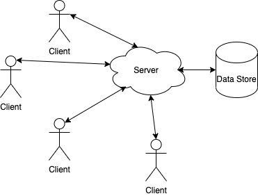

# Requirements

- [Requirements](#requirements)
  - [Client](#client)
  - [Server](#server)
  - [Data Store](#data-store)
  - [Overall Architecture](#overall-architecture)

There are three main components - the client, the server and the data store.

## Client

To be playable by the most people, the client must run on iOS, Android and Windows devices. Regardless of the platform, the clients must all be able to connect to the same server.

No permanent data store will be stored on the client and no major game logic will be performed on the client. This will help avoid data loss and minimize potential cheating. No great efforts will be made to avoid cheating.

See [here](client.md) for the detailed client requirements.

## Server

All main game logic and critical game data will be stored on the server. The server is the source of truth. Data on the server is the most up-to-date and is considered as fact.

The server allows the user to view and explore any game world and also to manage players. Players can be moved within a world, moved to a different world or kicked from the game. Player stats can also be altered. Game entities can be viewed and modified as needed.

Only basic 2D graphics rendering is required.

The server must run on iOS, Android and Windows devices. It must not overuse device resources and must respect the device's energy efficiency settings.

See [here](server.md) for the detailed server requirements.

## Data Store

Data that requires permanent persistance is stored on the server. Player and game information is stored here. Only data relevant to the game is stored. Any sensitive data, such as passwords, will be hashed and salted.

See [here](data_store.md) for detailed data store requirements.

## Overall Architecture

Here is a diagram describing the overall architecture:

