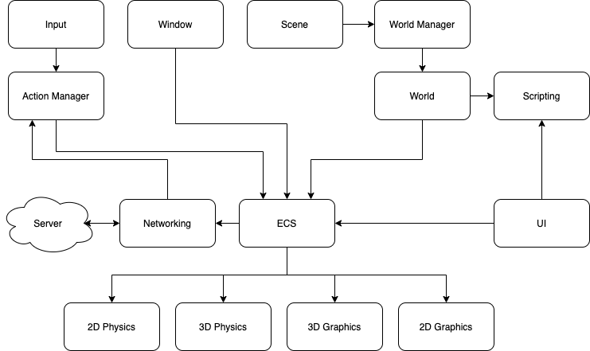

# Server

- [Server](#server)
  - [Graphics](#graphics)
  - [Window](#window)
  - [Input](#input)
  - [Networking](#networking)
  - [Scene](#scene)
  - [World](#world)
  - [Physics](#physics)
    - [2D Physics](#2d-physics)
  - [UI](#ui)
  - [ECS](#ecs)
  - [Scripting](#scripting)
  - [Data](#data)
  - [Component Architecture](#component-architecture)

All game logic and data is handled by the server.

The server has these components - graphics, window, input, networking, scene, world, physics, UI (User Interface), ECS (Entity Component System) and scripting.

Where possible, each component should work in its own thread and work independently of other components.

## Graphics

Basic 2D graphics are required to display a UI and the current world.

See [here](graphics.md) for more information.

## Window

Ability to create game window required. No need for full screen, but the window needs to be resizable.

## Input

Keyboard, mouse, and touch screen support is required. The input source should be abstracted into actions, which is what the game system will act on.

Input can be handled in the same thread as the windowing system.

## Networking

TCP and UDP must be supported. Network packets that must be received by the client should be sent via TCP. Packets that are not required should be sent over UDP.

UDP packets will be sent with a timestamp. This will help the client discard packets that are no longer up-to-date.

## Scene

Manages the current scene the user is in. A scene may or may not contain a world. The required scenes are:

- Loading
  - Handles the loading of worlds, various components and displays the loading UIs
- World
  - Contains the current running world and the UIs

## World

The world on the server represents the most up-to-date state of truth. It contains all entities and terrain data associated with the world.

A 2D grid is used to model the world. Tiles are used to indicate what the terrain is at that location. All entities have a 2D coordinate that indicates their location in the world. Static objects are stored in the world that are indicated by a type and a location.

Any changes to the tiles in the world are sent to the client as a required network packet, as this data only needs to be sent once. Entity updates are sent to the client as non-required network packets, as only the most up-to-date version of the state is useful.

All worlds are stored on the server as separate instances. All world instances must be self contained and not rely on data from any other world. Avatars and players can only be part of one world at a time. To assist with world management and transporting avatars and players from one world to another, a world manager will be used.

World tiles have attributes and types. Attributes indicate how avatars can interact with them and types indicate a display and function of a tile.

The following are the tile attributes:

- `runnable`
  - An avatar can run on this tile
- `walkable`
  - An avatar can walk on this tile
- `plantable`
  - Crops can be planted on this tile
- `teleport`
  - Teleport an avatar to another world
- `trigger`
  - Triggers a scripted action

The following are the tile types:

- `grass`
  - A patch of grass
- `beach`
  - A segment of beach
- `rock`
  - A segment of rock
- `mud`
  - A patch of mud
- `water_shallow`
  - Shallow water
- `water_deep`
  - Deep water

## Physics

2D is required.

### 2D Physics

Bounding box and circle collision, translation, rotation, dilation, reflection are required, along with acceleration and gravity. This will be used by the UI system and 2D particles.

## UI

See [UI](ui.md) for more information.

## ECS

All entities in the server are managed by the ECS (entity component system).

The following components are required:

- `location_2d`
  - Contains the 2D location of this entity in screen space
- `sprite`
  - Contains the data needed to render a 2D sprite. Requires a `location_2d` component.
- `material`
  - Contains the needed material data to render this entity, such as shader and textures.
- `rigid_body_2d`
  - Contains the needed data to handle 2D collisions, such as bounding box and circle collisions.
- `velocity_2d`
  - Contains the needed data to impart movement to the attached `location_2d` component.
- `script`
  - Contains the data needed to run a script that will act on this entity in some way. This will be used extensively for NPCs to run their AI.

## Scripting

Customizable workflows will be handled by scripting. These workflows are:

- UI events
- World tile triggers
- Avion AI behaviors
- Farming and mining tool behaviors

## Data

All external data should be stored in a folder called `data` that is in the same directory as the server's executable.

## Component Architecture

This is a diagram describing the overall architecture of the server:

