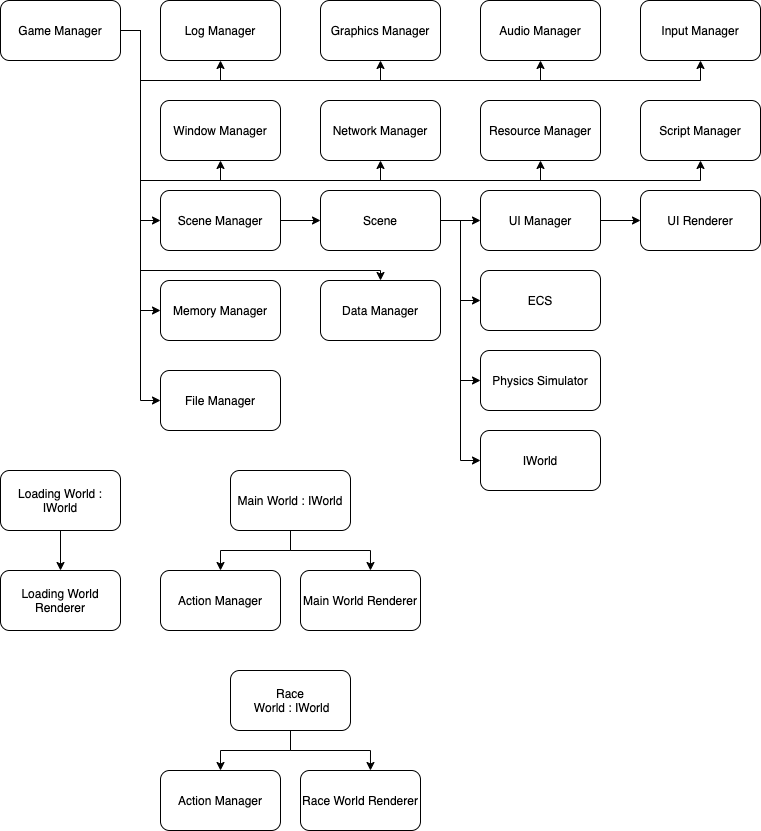

# Client

The player will communicate with the server by means of the client. All player interaction with the server will be by means of the client.

## Class Design

See [here](shared_classes.md) for more details on the major classes.

The overall class structure of the client will be as follows:

