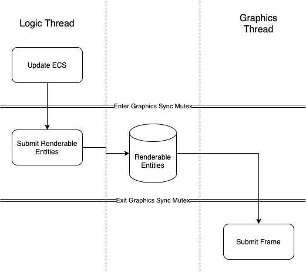

# Engine

A specific engine needs to be constructed to run the game. The engine is fully focused on this game, and not to support any other applications.

## Game Loop

The main thread controls the windowing and game logic. If the graphics API requires, it too will run on the main thread.

See [here](../requirements/entity_component_system.md) for how the ECS will work with the game loop.

Here is a diagram showing how each game loop is synchronized:

