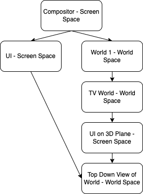

# Graphics

- [Graphics](#graphics)
  - [APIs](#apis)
    - [API Configuration](#api-configuration)
  - [Render Systems](#render-systems)
    - [Rendering Order](#rendering-order)
    - [2D Render System](#2d-render-system)
      - [2D Render System Materials](#2d-render-system-materials)
    - [3D Render System](#3d-render-system)
    - [Compositor](#compositor)
    - [Rendering Algorithm](#rendering-algorithm)
  - [Meshes](#meshes)
  - [Materials](#materials)
    - [Material Update Script](#material-update-script)
  - [Algorithms](#algorithms)
    - [Edge Detection](#edge-detection)
    - [Shadows](#shadows)
    - [Lighting](#lighting)
  - [Texturing](#texturing)
    - [Texture Names](#texture-names)
  - [Cameras](#cameras)
    - [Camera Graph](#camera-graph)
    - [Named Texture Render Targets](#named-texture-render-targets)

Rendering all graphical elements and loading graphics related resources are required.

## APIs

Both Vulkan and OpenGL are supported. The selection of these APIs will be decided at runtime. Each API implements a graphics manager.

Not all APIs support multithreading, so implemented graphics managers should indicate if they support multithreading or not.

### API Configuration

To configure which API to use, the following configuration is used in `data/graphics/config.json`, with the following structure:

```json
{
  "api": "<api name>"
}
```

`api` is the name of the API to use. The valid values are: `vulkan` and `opengl`.

## Render Systems

Different formats of graphics require their own render system. A render system is specific to that graphical format. The actual code to submit a frame is run on a separate thread to the main logic thread.

All entities that require rendering need to be submitted to a render system. Submitting entities is a thread safe operation. Entities must be submitted each frame. Frustum/view culling is performed on all entities by the respective render system.

Specific material types are supported by each system. If an entity is missing required material data, or the attached material is missing, A default value specified by the render system will be used.

### Rendering Order

There are two phases of rendering. In phase one, all render systems first render all cameras that have no dependencies on other render targets. Phase two then renders all cameras that have dependencies on a render target.

### 2D Render System

Renders 2D entities in screen space. Screen space is defined as `0.0f,0.0f` to `1.0f,1.0f`, where `0.0f,0.0f` is the top left and `1.0f,1.0f` is the bottom right of the screen.

A depth buffer is used, with +Z being 'further away' from the screen. The depth buffer ranges from `0.0f` to `1.0f`. Entities that share the same Z value will be displayed in the order of render, as in, the last entity submitted will appear to be the last entity rendered on screen.

Transparent entities are rendered after all opaque entities.

There is no camera, in the sense that there is no view matrix applied to any transformations. Scale and rotation matrices are applied to all rendered entities, with the origin points being the center point of that entity (i.e. `x + w/2`). No projection matrix is applied, so any rotations or scales in the Z direction will not affect the size (appearance of depth) of the entity.

Entity positions represent the top left corner of that entity.

Position, size and scale values must be in the range of screen space. Translations from pixel space to screen space are not the responsibility of this render system.

#### 2D Render System Materials

| Name | Colors | Textures | Description |
| -- | -- | -- | -- |
| Simple | Global | Albedo | A simple textured material. The global color is applied to the texture. |

### 3D Render System

### Compositor

All of the render targets will be passed to the compositor, where they will then be rendered to the screen. The screen will be a simple quad which will have the results of the render targets textured onto it.

It is expected that all post processing will have been performed on the render targets before the compositor renders them.

### Rendering Algorithm

This algorithm will be followed to render a complete scene:

```c++
// == load time ==
// load all cameras in scene

// submit cameras assigned to layers to the graphics manager

// == render time ==
// ECS submits all renderable entities in scene

// graphics manager to inform all render targets a new frame is beginning

// ensure that all named textures are rendered...
  // loop through all layers in graphics manager, starting from the furthest layer and ending with the closest layer
    // call render_entities(layer's camera)

// render_entities(camera)
  // get subset of renderable entities that are renderable from the camera
  // call prepare_renderable_entities(layer's camera, entities)
  // render entities using camera's render system (if the camera's render target is a texture, the render target object will mark itself as rendered)

// prepare_renderable_entities(camera, entities)
  // if camera has already been prepared
    // return
  // else
    // add camera to list of prepared cameras
  // for each entity
    // if named texture is not rendered
      // call render_entities(named texture's camera)

```

## Meshes

The required vertex layout for all meshes is as follows:

| Name | Type |
| -- | -- |
| Position X | `single` |
| Position Y | `single` |
| Position Z | `single` |
| Color R | `single` |
| Color G | `single` |
| Color B | `single` |
| Color A | `single` |
| Texture U | `single` |
| Texture V | `single` |

## Materials

Materials are scriptable.

### Material Update Script

The following function will be called at increments described by the `update_time` field:

- `onUpdate(material: Material)`

## Algorithms

Various rendering techniques require specific algorithms.

### Edge Detection

The [Sobel filter](https://en.wikipedia.org/wiki/Sobel_operator) will be used.

### Shadows

[Shadow depth mapping](https://learnopengl.com/Advanced-Lighting/Shadows/Shadow-Mapping) will be used.

### Lighting

[Blinn-Phong](https://en.wikipedia.org/wiki/Blinn%E2%80%93Phong_reflection_model) will be used.

## Texturing

2D textures will be used for all texture channels.

The following image formats are supported for texture data:

| Format |
| --- |
| PNG |

The following color formats are required for the channels:

| Channel | Format |
| --- | --- |
| Albedo | RGBA |
| Normal | RGB |
| Specular | BW |

### Texture Names

Textures are refereed to by their names, not their file paths.

The mapping between name and file path is defined in the `data/graphics/textures/textures.json` file. It has the following format:

```json
{
  "textures": [
    {
      "name": "texture name",
      "file_path": "path [optional]",
      "width": "default|wpx (where w = width in pixels)",
      "height": "default|hpx (where h = height in pixels)",
      "default_color": "color name|#FFFFFFFF [optional]"
    }
  ]
}
```

`name` is the name of the texture.

`file_path` is relative to the `data/graphics/textures/` directory. Duplicate names will cause an error. Duplicate file paths are allowed. The resource manager will ensure that duplicate files, at the same path, are not loaded into memory more than once.

`width` is the width in pixels the texture should be in memory. If loaded from an image, the texture will be scaled to this size.

`height` is the height in pixels the texture should be in memory. If loaded from an image, the texture will be scaled to this size.

`default_color` is the default color of this texture. If the texture is a render target, this will be the color before anything is rendered to it. This color will not affect the color of the texture if loaded from a file or when rendered to from a camera.

## Cameras

Cameras will always render to a target. A target will either be a screen surface, an in-memory texture or a named texture.

A camera can have dependent render targets, for instance, a mirror's reflection would need to be rendered before the mirror is rendered, or a 3D UI would need to be rendered before the object hosting the UI is rendered.

There is no limit to the dependencies, but circular dependencies are illegal.

### Camera Graph

There are two types of camera - screen space and world space. Render targets that are in screen space will be rendered using the 2D render system. World space targets will be rendered using the 3D render system.

The head of the graph will be the compositor's screen space camera. All other render targets will be dependencies of this camera.

When a camera is rendered, the respective render system is invoked to perform the render, with the result being stored in the camera's render target. This result can be reused as needed by other cameras.

As an example - a world scene has a TV screen that shows another world scene that contains a 3D UI, that contains a top view of another world scene. There is also a general UI which contains that same top view of the world. The dependency graph would look like this:



The dependency graphs are created by the scenes themselves.

### Named Texture Render Targets

If a named texture is rendered to, the material using that texture will display the results of that render.

When a camera renders to a named texture, if the named texture has an associated file that was loaded against it, the file will be disassociated and the rendered texture will take its place. The size of this new named texture will default to the size of the camera's viewport. If the named texture does not exist, it will be created and the size will be the same as the camera's viewport. If it does exist and is not associated with a file, the render will be scaled to the texture's size.
