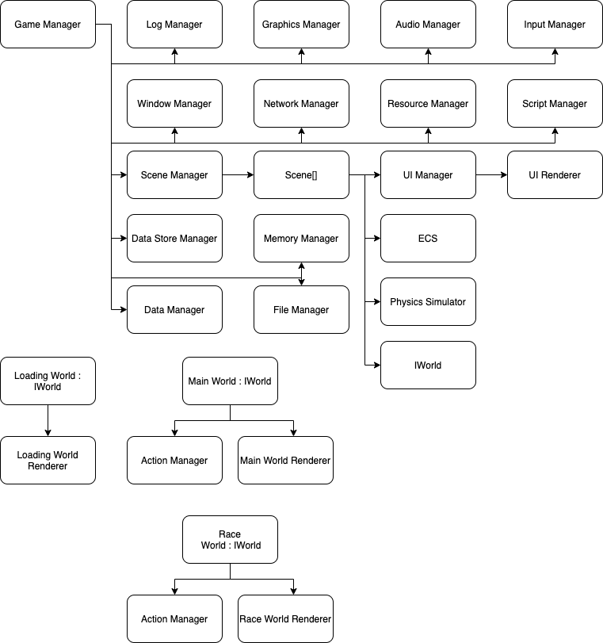

# Server

The server controls all game play and simulations. Players connect to the server through the client.

## Class Design

See [here](shared_classes.md) for more details on the major classes.

The overall class structure of the server will be as follows:

